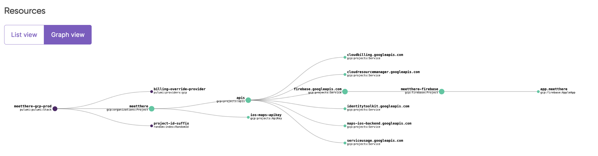

# Firebase on Pulumi IaC (GCP) - TypeScript

Heavily based on Firebase documentation for terraform: https://firebase.google.com/docs/projects/terraform/get-started - adapted for `pulumi` with some more configuration / logs to help !

Can be used as a repository template / quickstart.

## What does it do ?

The intended purpose is to have a quickstart on firebase on a brand new GCP project - with some feature configured:
1. Setups a new GCP Project with your billing account.
2. Activate minimum required services / APIs
3. Activates Firebase on the GCP Project
4. Sets up a secure ios API key with solely GMaps SDK activated
5. Sets up identity module as another example firebase feature

## Pulumi graph



## Quickstart

### Pre-requesites

- installed pulumi cli
- be logged in on pulumi
- have your own backend setup [optional]

### Project and stack

Update [./Pulumi.yaml](./Pulumi.yaml) with your project name (`myapp-gcp`).

Then, setup a new stack _(with your updated name)_:
```bash
pulumi stack init YOURNAME/myapp-gcp/prod
```

### Configuration

Then, set your configuration based on the settings in [./src/variables.ts](./src/variables.ts)
```
pulumi config set NAME_OF_VAR VALUE_OF_VAR
```

### Configuration recommendation

Use `--secret` flag to hide sensitive configuration in stack config !

Using `gcp:credentials` prevents conflict between `gcloud` configurations (And their activation) - you can usually find your `gcloud` credentials in `~/.config/gcloud/`. 

### Start

Then, start your project (or `plan`) !
```
pulumi up
```
Manual actions and outputs will be logged automatically as ressources get created to help you (Not all things can be IaC-ed !)

## Ressources / Documentations

Pulumi => <https://www.pulumi.com/>

Pulumi GCP Provider Documentation => https://www.pulumi.com/registry/packages/gcp/

Firebase Terraform Setup by GCP => https://firebase.google.com/docs/projects/terraform/get-started
